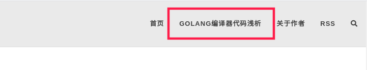

由于 Golang 实现了自举，即整个 Golang 的工具链都是用 Go 语言实现的，这对于想要深入学习 Golang 各个方面知识的用户来说非常友好，本文尝试着从代码层面全面地介绍编译器的实现，希望能够为想要了解这方面知识的同学提供一些指引。

阅读全文请移步：[Go Compiler Link](https://gocompiler.shizhz.me), 或者通过页面上方链接进入：

同时欢迎读者通过页面下方的邮箱提供任何反馈，谢谢。
